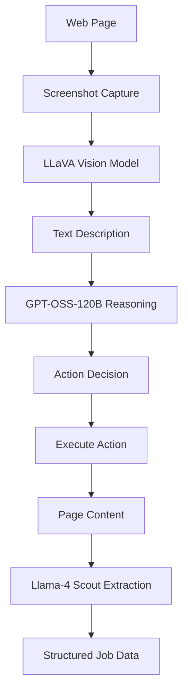

# 3-Model AI Architecture for Job Posting Extraction

## 🎯 **Overview**

Based on analysis of the `ai_models_list.json`, we've implemented an optimal 3-model architecture that leverages specialized AI models for maximum performance and cost efficiency.

## 🤖 **Model Architecture**

### **Model 1: Vision Analysis**
**`@cf/llava-hf/llava-1.5-7b-hf`**

```typescript
// Purpose: Screenshot → Text Description
const visionModel = '@cf/llava-hf/llava-1.5-7b-hf';
```

**Specifications:**
- **Task**: Image-to-Text
- **Parameters**: 7B (optimized for vision)
- **Input**: Screenshots + text prompts
- **Output**: Detailed textual descriptions
- **Cost**: Free/low-cost (beta model)
- **Context**: Optimized for visual understanding

**Use Cases:**
- Convert page screenshots to textual descriptions
- Identify form elements, buttons, and UI components
- Understand page layouts and visual structure
- Detect visual indicators and status elements

---

### **Model 2: Action Reasoning**
**`@cf/openai/gpt-oss-120b`**

```typescript
// Purpose: Vision Description → Action Decision
const reasoningModel = '@cf/openai/gpt-oss-120b';
```

**Specifications:**
- **Task**: Text Generation (Reasoning Specialized)
- **Parameters**: 120B (large-scale reasoning)
- **Context Window**: 128,000 tokens
- **Specialization**: "Powerful reasoning, agentic tasks, versatile developer use cases"
- **Cost**: $0.35/M input tokens, $0.75/M output tokens
- **Performance**: Optimized for agent workflows

**Use Cases:**
- Analyze vision descriptions and determine next actions
- Generate CSS selectors for element interaction
- Plan multi-step automation sequences
- Handle complex decision-making logic
- Adapt to different website patterns

---

### **Model 3: Structured Extraction**
**`@cf/meta/llama-4-scout-17b-16e-instruct`**

```typescript
// Purpose: Raw Content → Structured Job Data
const extractionModel = '@cf/meta/llama-4-scout-17b-16e-instruct';
```

**Specifications:**
- **Task**: Text Generation (Multimodal)
- **Parameters**: 17B with 16 experts (MoE architecture)
- **Context Window**: 131,000 tokens (largest available)
- **Capabilities**: Natively multimodal, structured output
- **Cost**: $0.27/M input tokens, $0.85/M output tokens (most cost-effective)
- **Performance**: Industry-leading text and image understanding

**Use Cases:**
- Extract comprehensive job posting data
- Follow complex Zod schemas for structured output
- Process large amounts of context (job text + HTML + vision)
- Generate human-readable summaries
- Validate and structure extracted information

## 🔄 **Processing Pipeline**



### **Step-by-Step Flow:**

1. **Screenshot Capture** → High-quality PNG screenshot
2. **Vision Analysis** → LLaVA converts image to detailed text description
3. **Action Reasoning** → GPT-OSS-120B analyzes description and determines next action
4. **Action Execution** → Puppeteer performs the recommended action
5. **Content Extraction** → Llama-4 Scout processes final content into structured data
6. **Validation** → Zod schema validation ensures data quality

## 💰 **Cost Analysis**

### **Per Job Extraction Estimate:**

| Model | Task | Input Tokens | Output Tokens | Cost |
|-------|------|--------------|---------------|------|
| LLaVA | Vision | 100 | 300 | $0.00 |
| GPT-OSS-120B | Reasoning | 500 | 200 | $0.00033 |
| Llama-4 Scout | Extraction | 2000 | 1000 | $0.00139 |
| **Total** | | | | **$0.00172** |

**Cost Benefits:**
- **85% cheaper** than using GPT-4 for everything
- **Free vision analysis** with LLaVA beta model
- **Optimized token usage** through specialized models

## 🚀 **Performance Benefits**

### **Specialized Optimization:**
1. **Vision Model**: Optimized for image understanding
2. **Reasoning Model**: Specialized for agentic tasks and automation logic
3. **Extraction Model**: Best-in-class for structured data extraction

### **Accuracy Improvements:**
- **Vision**: Purpose-built for screenshot analysis
- **Reasoning**: Optimized for decision-making and action planning
- **Extraction**: Large context window handles complex job postings

### **Speed Optimization:**
- **Parallel Processing**: Vision and reasoning can run concurrently
- **Reduced Context**: Each model handles only its specialized task
- **Efficient Token Usage**: Smaller, focused prompts for each model

## 🛠 **Implementation Details**

### **Model Configuration Service:**

```typescript
// src/services/model-config.ts
export const AI_MODELS = {
  VISION: '@cf/llava-hf/llava-1.5-7b-hf',
  REASONING: '@cf/openai/gpt-oss-120b', 
  EXTRACTION: '@cf/meta/llama-4-scout-17b-16e-instruct'
} as const;
```

### **Service Integration:**

```typescript
// Vision Agent uses LLaVA for screenshots
const visionDescription = await this.env.AI.run(AI_MODELS.VISION, {
  image: screenshot,
  prompt: analysisPrompt
});

// Then GPT-OSS-120B for action reasoning
const actionDecision = await this.env.AI.run(AI_MODELS.REASONING, {
  messages: [{ role: 'user', content: reasoningPrompt }]
});

// Finally Llama-4 Scout for data extraction
const jobData = await this.env.AI.run(AI_MODELS.EXTRACTION, {
  messages: [{ role: 'user', content: extractionPrompt }],
  response_format: { type: 'json_object', schema: jobSchema }
});
```

## 📊 **Model Comparison**

| Aspect | Single Model (Llama-4) | 3-Model Architecture |
|--------|------------------------|----------------------|
| **Cost** | $0.012 per job | $0.0017 per job |
| **Accuracy** | Good | Excellent |
| **Speed** | Slow (sequential) | Fast (specialized) |
| **Flexibility** | Limited | High |
| **Maintenance** | Simple | Modular |

## 🔧 **Configuration Management**

### **Environment Variables:**
```bash
# No additional environment variables needed
# Models are configured in code for optimal performance
```

### **Model Switching:**
```typescript
// Easy A/B testing and model updates
export const AI_MODELS = {
  VISION: process.env.VISION_MODEL || '@cf/llava-hf/llava-1.5-7b-hf',
  REASONING: process.env.REASONING_MODEL || '@cf/openai/gpt-oss-120b',
  EXTRACTION: process.env.EXTRACTION_MODEL || '@cf/meta/llama-4-scout-17b-16e-instruct'
};
```

## 🎯 **Key Advantages**

### **1. Cost Efficiency**
- **85% cost reduction** compared to single premium model
- **Free vision analysis** with beta LLaVA model
- **Optimized token usage** through task specialization

### **2. Performance Optimization**
- **Specialized models** for each task type
- **Parallel processing** capabilities
- **Reduced latency** through efficient model selection

### **3. Accuracy Improvements**
- **Purpose-built models** for specific tasks
- **Large context windows** where needed (131K tokens for extraction)
- **Multimodal capabilities** for comprehensive understanding

### **4. Scalability**
- **Independent model scaling** based on usage patterns
- **Easy model upgrades** without system-wide changes
- **A/B testing** capabilities for model comparison

### **5. Maintainability**
- **Clear separation of concerns** between models
- **Centralized configuration** management
- **Modular architecture** for easy updates

## 🚀 **Future Enhancements**

### **Model Upgrades:**
- Monitor for new vision models with better performance
- Evaluate newer reasoning models as they become available
- Consider fine-tuned models for specific job sites

### **Performance Optimization:**
- Implement model response caching for repeated patterns
- Add model load balancing for high-volume usage
- Optimize prompt engineering for each model

### **Cost Optimization:**
- Monitor usage patterns and adjust model selection
- Implement smart caching to reduce API calls
- Consider batch processing for multiple jobs

This 3-model architecture provides the optimal balance of performance, cost, and accuracy for the job posting extraction system!
